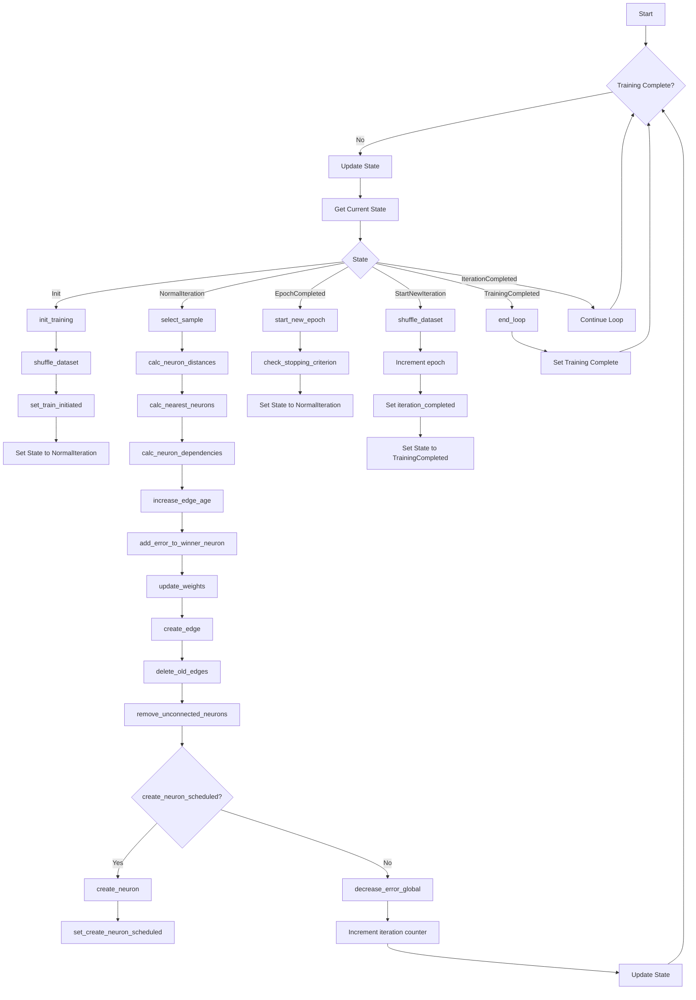
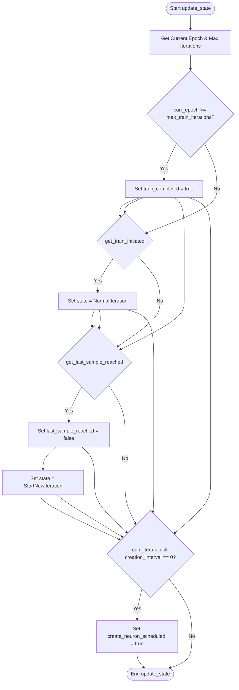
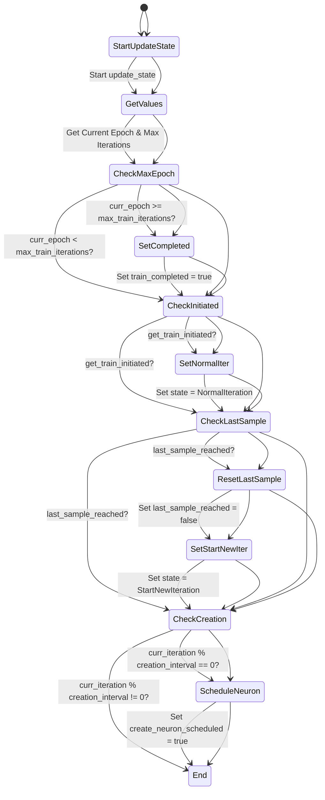
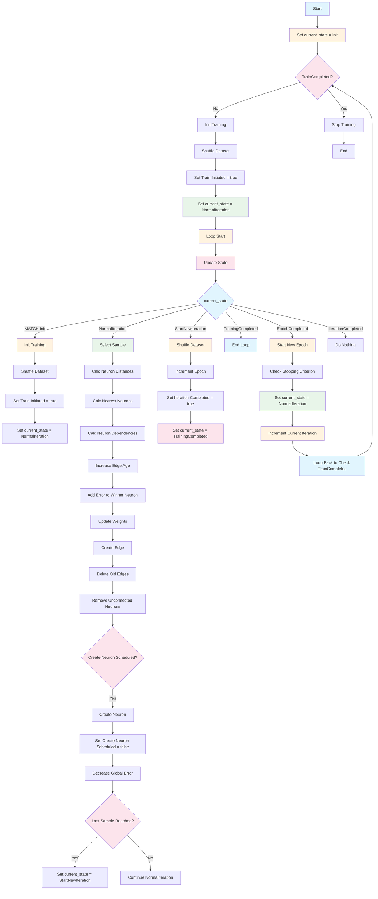
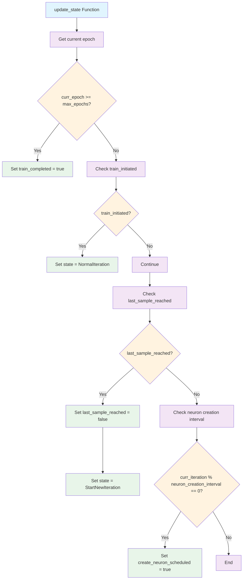

# GNG Training Loop - fit() Function

## UML Activity Diagram

## Function Overview

The `fit` function implements the main training loop for the Growing Neural Gas (GNG) algorithm. It manages the entire training process through multiple states and iterations until the stopping criterion is met.

## Key Components

1. **State Management**: The function uses a `State` enum to control the flow through different phases of training
2. **Training Loop**: Continuous loop that processes samples and updates network structure
3. **Neural Gas Operations**: Core GNG operations including neuron creation, edge management, and weight updates
4. **Stopping Criteria**: Checks for termination conditions at epoch boundaries

## State Transitions

- **Init**: Initialize training parameters and dataset
- **NormalIteration**: Main training cycle processing samples and updating network
- **EpochCompleted**: Handle epoch completion and stopping criterion checks
- **StartNewIteration**: Prepare for next iteration
- **TrainingCompleted**: Finalize training process

## Core Operations

- Sample selection and processing
- Neuron distance calculations
- Nearest neuron identification
- Edge age management
- Error accumulation and propagation
- Weight updates
- Edge creation and deletion
- Neuron creation when needed
- Global error reduction

# FIT + State change

# NEW

