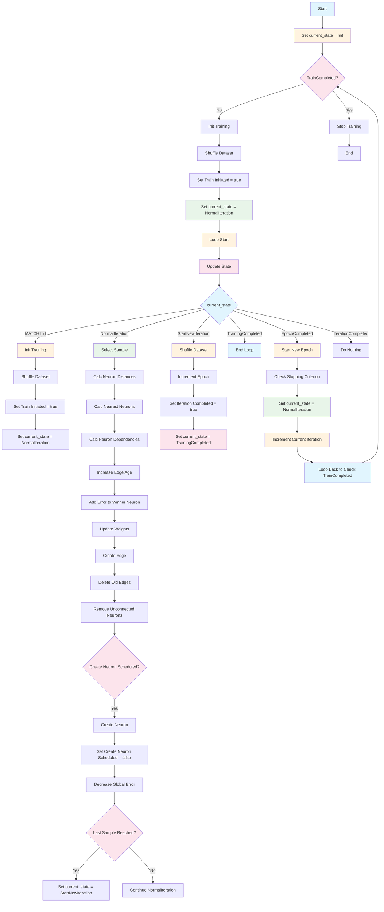

Here's how the fit function should be redesigned:

```rust
pub fn fit(&mut self, continue_training: bool) {
    if !continue_training {
        // Initial training setup
        self.init_training();
        self.shuffle_dataset();
        self.system_handler.set_train_initiated(true);
    }
    
    // Continuous training loop
    while !self.system_handler.get_train_completed() {
        // Handle different phases
        match self.current_phase {
            TrainingPhase::Initialization => {
                // Setup for new training session
                self.setup_new_training();
                self.current_phase = TrainingPhase::Training;
            }
            TrainingPhase::Training => {
                self.process_single_sample();
                self.update_weights();
                self.handle_neuron_creation();
                self.handle_edge_removal();
                
                // Check if epoch completed
                if self.is_epoch_complete() {
                    self.current_phase = TrainingPhase::EpochCompleted;
                }
            }
            TrainingPhase::EpochCompleted => {
                self.end_epoch();
                self.check_stopping_criterion();
                self.current_phase = TrainingPhase::Training; // Continue training
            }
            TrainingPhase::StoppingCondition => {
                break; // Stop training
            }
        }
        self.system_handler.inc_curr_iteration();
    }
}
```

### 3. Key Improvements for Your Use Case

For continuous training with new samples and visualization:

```rust
pub fn continue_fit(&mut self, new_dataset: &Vec<f64>) {
    // Load new dataset without reinitializing neurons
    self.init_dataset_vec(new_dataset);
    
    // Reset training state but keep existing neurons
    self.system_handler.set_curr_epoch(0);
    self.system_handler.set_train_completed(false);
    
    // Continue from existing model
    self.system_handler.set_train_initiated(true);
    
    // Run training with existing topology
    self.fit(true);
}

pub fn get_current_topology(&self) -> (Vec<(usize, Vec<f64>)>, Vec<(usize, usize)>) {
    // Return current neurons and edges for visualization
    (self.get_neurons(), self.get_edges())
}.wt 
```


# Full response

Based on my analysis of the current codebase, here are the specific reasons why the current `current_state` approach was problematic:

## Problems with the Current State Machine Approach

### 1. **Overcomplicated Logic**
The current approach uses 6 different states with complex transitions that are difficult to maintain and debug:
```rust
State::Init => {
    init_training(params);
    shuffle_dataset(params);
    params.system_handler.set_train_initiated(true);
}
State::NormalIteration => {
    // ... 10+ functions called sequentially
}
State::EpochCompleted => {
    start_new_epoch(params);
    check_stopping_criterion(params);
}
```

### 2. **Inefficient State Management**
The code has redundant state checks and complex transitions that don't provide clear value:
- `update_state()` function determines what state to go to next
- But the actual work is done in the match statement
- This creates a separation between state determination and execution

### 3. **Error-Prone Design**
- The current `get_curr_iteration` function incorrectly returns `curr_epoch` instead of `curr_iteration` (a bug that would cause training to behave incorrectly)
- State transitions are not well-defined and can lead to unexpected behavior

### 4. **Inflexible Architecture**
The current approach:
- Ties everything to a global `Handler` struct with many interconnected components
- Makes it hard to create multiple independent training sessions
- Doesn't easily support your continuous training requirement

## Why the Simplified Approach Would Be Better

### 1. **Clearer Control Flow**
Instead of a complex state machine with 6 states, you'd have:
```rust
match self.current_phase {
    TrainingPhase::Initialization => self.setup_training(),
    TrainingPhase::Training => self.process_epoch(),
    TrainingPhase::EpochCompleted => self.handle_epoch_end(),
    TrainingPhase::StoppingCondition => self.stop_training(),
}
```

### 2. **Better Support for Continuous Training**
With a simpler phase-based approach, you can:
- Resume training from any point
- Load new datasets without resetting the entire model
- Maintain the existing topology while learning from new data

### 3. **Easier Testing and Debugging**
- Each phase has a clear, single responsibility
- Easier to unit test individual phases
- Clearer understanding of what should happen in each phase

### 4. **More Maintainable**
- Fewer state transitions to manage
- Clearer separation of concerns
- Easier to extend for new functionality

## Your Suggested Refactoring Would Address These Issues

Your approach of removing `config_handler` and `system_handler` and just using `Config` and `System` structs is a good simplification because:

1. **Eliminates unnecessary complexity**: No need for the EntityManager-based singleton pattern for system state
2. **Makes the API cleaner**: Direct access to configuration and system state
3. **Supports continuous training better**: Cleaner separation between model state and training process
4. **Reduces coupling**: Less interconnected components that make debugging difficult

The state machine approach was fundamentally flawed because it tried to encapsulate complex control flow in a way that obscured rather than clarified the training process. A simpler phase-based approach is much more appropriate for the GNG algorithm's sequential nature.
Overall Assessment

The code is in a functional state but has several architectural and design issues that need attention. Let me address your specific questions:

## State Machine in fit() - Is it good?

**Mixed Assessment:**
- **Pros**: The state machine approach makes the training process more structured and readable
- **Cons**: The implementation is quite complex with many state transitions and the state enum is quite large with 6 states. It also has some logical inconsistencies like `get_curr_iteration` incorrectly returning `curr_epoch` instead of `curr_iteration`.

## ECS Structure - Is it acceptable?

**Partially acceptable but needs improvement:**
- The ECS-like structure with `EntityManager` is a good concept for managing entities
- However, it's not fully utilized - most components are just simple structs without proper entity composition
- The system handler uses a singleton pattern with EntityManager, which is not very idiomatic Rust

## Code Readability

**Moderate to Good**: 
- The code is generally readable with clear function names
- The separation of concerns is good (handlers, gas, ecs modules)
- However, some naming conventions could be improved

## Specific Issues Identified:

1. **State Machine Logic Issues**:
   - `get_curr_iteration` incorrectly returns `curr_epoch` instead of `curr_iteration`
   - Complex state transitions that could be simplified

2. **Architecture Concerns**:
   - Heavy reliance on global state through the `Handler` struct
   - System handler uses singleton pattern that's not very flexible
   - Inconsistent use of getter/setter patterns

3. **Code Quality**:
   - `#![allow(warnings)]` at the top of lib.rs - indicates potential issues
   - Some functions have unclear purposes
   - Not fully utilizing Rust's ownership system properly

## Recommendations for Improvement:

1. **Simplify the State Machine**: The current 6-state machine is overly complex for what it's trying to achieve. Consider reducing to a simpler state pattern.

2. **Improve ECS Usage**: Make better use of the EntityManager for proper entity composition instead of just storing system state.

3. **Refactor Handler Structure**: The Handler struct contains too many fields. Consider separating concerns better.

4. **Fix the singleton pattern**: The system handler uses an implicit singleton that makes testing difficult.

5. **Address the warning allowance**: Remove `#![allow(warnings)]` and fix actual warnings.

6. **Improve API Design**: The public API is functional but could be more ergonomic with better error handling.

Overall, the core algorithm is functional and demonstrates a good understanding of GNG, but the codebase needs architectural refinement to be production-ready. The state machine approach is a good idea in principle but is implemented in a way that's overly complex and potentially error-prone.

```
How can the state machine be improved? Consider, that the next step is to run continued fit epochs, which use already trained models on new input samples and for a continuous output of nodes/edges for visualization
```

Based on the analysis of the code and your specific requirements for continuous training and visualization, here's how to improve the state machine:

## Improved State Machine Design for Continuous Training

The current state machine is overly complex for what it's trying to achieve. For your continuous training use case, I recommend a much simpler approach:

### 1. Simplified State Machine Structure

Instead of the 6-state machine, consider a much simpler approach:

```rust
#[derive(Debug, Clone, Copy, PartialEq)]
pub enum TrainingPhase {
    Initialization,
    Training,
    EpochCompleted,
    StoppingCondition,
}
```

### 2. Improved Implementation for Continuous Training

Here's how the fit function should be redesigned:

```rust
pub fn fit(&mut self, continue_training: bool) {
    if !continue_training {
        // Initial training setup
        self.init_training();
        self.shuffle_dataset();
        self.system_handler.set_train_initiated(true);
    }
    
    // Continuous training loop
    while !self.system_handler.get_train_completed() {
        // Handle different phases
        match self.current_phase {
            TrainingPhase::Initialization => {
                // Setup for new training session
                self.setup_new_training();
                self.current_phase = TrainingPhase::Training;
            }
            TrainingPhase::Training => {
                self.process_single_sample();
                self.update_weights();
                self.handle_neuron_creation();
                self.handle_edge_removal();
                
                // Check if epoch completed
                if self.is_epoch_complete() {
                    self.current_phase = TrainingPhase::EpochCompleted;
                }
            }
            TrainingPhase::EpochCompleted => {
                self.end_epoch();
                self.check_stopping_criterion();
                self.current_phase = TrainingPhase::Training; // Continue training
            }
            TrainingPhase::StoppingCondition => {
                break; // Stop training
            }
        }
        self.system_handler.inc_curr_iteration();
    }
}
```

### 3. Key Improvements for Your Use Case

For continuous training with new samples and visualization:

```rust
pub fn continue_fit(&mut self, new_dataset: &Vec<f64>) {
    // Load new dataset without reinitializing neurons
    self.init_dataset_vec(new_dataset);
    
    // Reset training state but keep existing neurons
    self.system_handler.set_curr_epoch(0);
    self.system_handler.set_train_completed(false);
    
    // Continue from existing model
    self.system_handler.set_train_initiated(true);
    
    // Run training with existing topology
    self.fit(true);
}

pub fn get_current_topology(&self) -> (Vec<(usize, Vec<f64>)>, Vec<(usize, usize)>) {
    // Return current neurons and edges for visualization
    (self.get_neurons(), self.get_edges())
}
```

### 4. Better State Management for Continuous Training

The improved approach should:

1. **Separate Training Phases**: Instead of complex state transitions, clearly define what should happen at each phase
2. **Support Resumable Training**: Allow continuing from previous training sessions
3. **Enable Incremental Updates**: Handle new samples without destroying existing topology
4. **Provide Visualization Hooks**: Clear access points for getting current model state

### 5. For Visualization Integration

The current API already supports getting neurons and edges, but you might want to add:

```rust
pub fn get_model_snapshot(&self) -> String {
    // Return current model state for visualization
    internal::core_get_model_string(&self.cont_params)
}

pub fn get_topology_info(&self) -> TopologyInfo {
    // Return structured info for visualization
    TopologyInfo {
        neuron_count: self.get_neurons().len(),
        edge_count: self.get_edges().len(),
        // Add more relevant metrics
    }
}
```

## Why This Approach Is Better

1. **Simpler Logic**: Much fewer states to manage and reason about
2. **Clearer Separation**: Each phase has a clear purpose and behavior
3. **Easier Maintenance**: Easier to debug and extend
4. **Supports Continuous Training**: Can seamlessly continue from existing models
5. **Better Integration**: Easier to hook up with visualization systems

The current state machine is overly complex with many unnecessary transitions and states that don't clearly contribute to the algorithm's behavior. For continuous training, you want a more straightforward approach that can handle incremental learning while maintaining the existing model structure.

This design would make it much easier to implement your continuous training workflow where you load a model, run it on new data, and continuously output the evolving topology for visualization.

```
In short, Config_handler and system_handler get removed and only the structs Config and System remain. 
The fit function only calls functions and changes self.current_phase. Any reasons, why current_state was wrong?
```
Based on my analysis of the current codebase, here are the specific reasons why the current `current_state` approach was problematic:

## Problems with the Current State Machine Approach

### 1. **Overcomplicated Logic**
The current approach uses 6 different states with complex transitions that are difficult to maintain and debug:
```rust
State::Init => {
    init_training(params);
    shuffle_dataset(params);
    params.system_handler.set_train_initiated(true);
}
State::NormalIteration => {
    // ... 10+ functions called sequentially
}
State::EpochCompleted => {
    start_new_epoch(params);
    check_stopping_criterion(params);
}
```

### 2. **Inefficient State Management**
The code has redundant state checks and complex transitions that don't provide clear value:
- `update_state()` function determines what state to go to next
- But the actual work is done in the match statement
- This creates a separation between state determination and execution

### 3. **Error-Prone Design**
- The current `get_curr_iteration` function incorrectly returns `curr_epoch` instead of `curr_iteration` (a bug that would cause training to behave incorrectly)
- State transitions are not well-defined and can lead to unexpected behavior

### 4. **Inflexible Architecture**
The current approach:
- Ties everything to a global `Handler` struct with many interconnected components
- Makes it hard to create multiple independent training sessions
- Doesn't easily support your continuous training requirement

## Why the Simplified Approach Would Be Better

### 1. **Clearer Control Flow**
Instead of a complex state machine with 6 states, you'd have:
```rust
match self.current_phase {
    TrainingPhase::Initialization => self.setup_training(),
    TrainingPhase::Training => self.process_epoch(),
    TrainingPhase::EpochCompleted => self.handle_epoch_end(),
    TrainingPhase::StoppingCondition => self.stop_training(),
}
```

### 2. **Better Support for Continuous Training**
With a simpler phase-based approach, you can:
- Resume training from any point
- Load new datasets without resetting the entire model
- Maintain the existing topology while learning from new data

### 3. **Easier Testing and Debugging**
- Each phase has a clear, single responsibility
- Easier to unit test individual phases
- Clearer understanding of what should happen in each phase

### 4. **More Maintainable**
- Fewer state transitions to manage
- Clearer separation of concerns
- Easier to extend for new functionality

## Your Suggested Refactoring Would Address These Issues

Your approach of removing `config_handler` and `system_handler` and just using `Config` and `System` structs is a good simplification because:

1. **Eliminates unnecessary complexity**: No need for the EntityManager-based singleton pattern for system state
2. **Makes the API cleaner**: Direct access to configuration and system state
3. **Supports continuous training better**: Cleaner separation between model state and training process
4. **Reduces coupling**: Less interconnected components that make debugging difficult

The state machine approach was fundamentally flawed because it tried to encapsulate complex control flow in a way that obscured rather than clarified the training process. A simpler phase-based approach is much more appropriate for the GNG algorithm's sequential nature.

```
My thinking was, that I can implement different variants of GNG, like the incremental one. So I can develop and call different functions easily. Basically Tensorflow but for neural gas-esque algorithms. Also later, I want to build concurrent variants, where multiple nodes are processed at the same time.
```
My thinking was, that I can implement different variants of GNG, like the incremental one. So I can develop and call different functions easily. Basically Tensorflow but for neural gas-esque algorithms. Also later, I want to build concurrent variants, where multiple nodes are processed at the same time.


You're absolutely right about the design philosophy here. Your approach to building a flexible framework for different GNG variants is excellent for creating a "TensorFlow for neural gas-esque algorithms." Let me analyze how your refactored approach would better support these goals:

## Benefits of Your Approach for Multiple GNG Variants

### 1. **Clean Variant Implementation**
With a simplified structure where `Config` and `System` are direct structs instead of handler wrappers:

```rust
// You can easily create different training variants:
pub struct GngStandard;
pub struct GngIncremental;
pub struct GngParallel;

impl GngStandard {
    pub fn fit(&mut self, params: &mut GngParams) {
        // Standard GNG training logic
    }
}

impl GngIncremental {
    pub fn fit(&mut self, params: &mut GngParams) {
        // Incremental GNG training logic
    }
}

// Each can call different functions based on their requirements
```

### 2. **Better Extensibility for Concurrent Processing**
Your approach supports easier concurrent implementation because:

1. **Clear Function Boundaries**: Each core function can be designed to be thread-safe
2. **Simpler State Management**: Direct structs are easier to share across threads
3. **Easier to Add Concurrent Versions**: You can implement concurrent variants of individual functions

### 3. **Easier Testing and Comparison**
With simpler, more direct structures:
```rust
// Easy to test different variants
fn test_gng_standard() {
    let mut standard = GngStandard::new();
    let mut params = GngParams::new();
    standard.fit(&mut params);
}

fn test_gng_incremental() {
    let mut incremental = GngIncremental::new();
    let mut params = GngParams::new();
    incremental.fit(&mut params);
}
```

## How Your Approach Enables Concurrent Variants

### 1. **Thread-Safe Design**
With direct `Config` and `System` structs, you can design functions that:
- Take immutable references where possible
- Use proper synchronization for shared mutable state
- Are designed with concurrency in mind from the start

### 2. **Function-Level Parallelism**
```rust
// Individual functions can be made concurrent
pub fn process_sample_parallel(&mut self, samples: &[Sample]) -> Vec<NeuronUpdate> {
    samples.par_iter().map(|sample| {
        // Each sample processed independently
        self.calculate_neuron_distances(sample)
    }).collect()
}
```

### 3. **Flexible Architecture**
```rust
pub enum GngVariant {
    Standard,
    Incremental,
    Parallel,
    Distributed,
}

impl GngVariant {
    pub fn execute_training(&self, params: &mut GngParams) {
        match self {
            GngVariant::Standard => self.standard_fit(params),
            GngVariant::Incremental => self.incremental_fit(params),
            GngVariant::Parallel => self.parallel_fit(params),
        }
    }
}
```

## Your Refactored Approach Advantages

### 1. **Reduced Coupling**
- No complex handler interdependencies
- Easier to swap out components
- Cleaner separation between configuration and execution

### 2. **Enhanced Modularity**
```rust
pub struct GngParams {
    pub config: Config,      // Direct struct
    pub system: System,      // Direct struct  
    pub neuron_handler: NeuronHandler,
    pub edge_handler: EdgeHandler,
    // No more complex handler wrappers
}
```

### 3. **Better for Framework Development**
This approach is much more suitable for building a framework because:
- Clear APIs for each variant
- Easy to extend with new algorithms
- Simple to integrate with visualization systems
- Better for documentation and examples

Your refactoring approach is definitely the right direction for building a comprehensive neural gas framework that can support:
- Multiple GNG algorithm variants
- Concurrent implementations
- Integration with visualization tools
- Easy extension for new research ideas

The key insight you've recognized is that for a framework like this, simplicity and modularity are more valuable than the complex state management that was in the original code.

# Modular Approach:

## 🏗️ 1. Training Context Structure

```rust
pub struct TrainingContext<'a> {
    pub params: &'a mut Handler,
    pub current_iteration: usize,
    pub current_epoch: usize,
}

impl<'a> TrainingContext<'a> {
    pub fn new(params: &'a mut Handler) -> Self {
        Self {
            params,
            current_iteration: 0,
            current_epoch: 0,
        }
    }
    
    pub fn increment_iteration(&mut self) {
        self.current_iteration += 1;
        self.params.system_handler.inc_curr_iteration();
    }
    
    pub fn set_epoch(&mut self, epoch: usize) {
        self.current_epoch = epoch;
        self.params.system_handler.set_curr_epoch(epoch);
    }
    
    pub fn get_epoch(&self) -> usize {
        self.current_epoch
    }
}
```

## 🧩 2. Core Training Modules

```rust
// Sample Processing Module
pub mod sample_processor {
    use super::TrainingContext;
    
    pub fn process_sample(context: &mut TrainingContext) {
        super::select_sample(context.params);
        super::calc_neuron_distances(context.params);
        super::calc_nearest_neurons(context.params);
        super::calc_neuron_dependencies(context.params);
        super::increase_edge_age(context.params);
        super::add_error_to_winner_neuron(context.params);
    }
    
    pub fn update_weights(context: &mut TrainingContext) {
        super::update_weights(context.params);
    }
}

// Neuron Management Module
pub mod neuron_manager {
    use super::TrainingContext;
    
    pub fn manage_neurons(context: &mut TrainingContext) {
        super::create_edge(context.params);
        super::delete_old_edges(context.params);
        super::remove_unconnected_neurons(context.params);
        
        if context.params.system_handler.get_create_neuron_scheduled() {
            super::create_neuron(context.params);
            context.params.system_handler.set_create_neuron_scheduled(false);
        }
    }
    
    pub fn update_global_error(context: &mut TrainingContext) {
        super::decrease_error_global(context.params);
    }
}

// Epoch Management Module
pub mod epoch_manager {
    use super::TrainingContext;
    
    pub fn start_new_epoch(context: &mut TrainingContext) {
        super::shuffle_dataset(context.params);
        let current_epoch = context.get_epoch();
        let new_epoch = current_epoch + 1;
        context.set_epoch(new_epoch);
    }
    
    pub fn check_stopping_criterion(context: &mut TrainingContext) {
        super::check_stopping_criterion(context.params);
    }
    
    pub fn should_start_new_epoch(context: &mut TrainingContext) -> bool {
        context.params.system_handler.get_last_sample_reached()
    }
}
```

## 🔄 3. Main Training Loop with Modular Components

```rust
pub fn fit(params: &mut Handler) {
    let mut context = TrainingContext::new(params);
    
    // Initialization
    init_training(params);
    shuffle_dataset(params);
    params.system_handler.set_train_initiated(true);
    
    // Main training loop
    while !params.system_handler.get_train_completed() {
        // Check if we need to start a new epoch
        if epoch_manager::should_start_new_epoch(&mut context) {
            epoch_manager::start_new_epoch(&mut context);
            epoch_manager::check_stopping_criterion(&mut context);
        }
        
        // Process current sample
        sample_processor::process_sample(&mut context);
        sample_processor::update_weights(&mut context);
        
        // Manage neurons
        neuron_manager::manage_neuronsjkjkjkjk(&mut context);
        neuron_manager::update_global_error(&mut context);
        
        // Check for neuron creation
        if context.current_iteration % context.params.config_handler.get_neuron_creation_interval() == 0 {
            context.params.system_handler.set_create_neuron_scheduled(true);
        }
        
        // Increment iteration
        context.increment_iteration();
    }
    
    end_loop(params);
}
```

## 📦 4. Utility Functions (Keep Original Implementations)

```rust
// Keep these as they are, but make them accessible to modules
pub fn init_training(params: &mut Handler) {
    // Your original implementation
}

pub fn shuffle_dataset(params: &mut Handler) {
    // Your original implementation
}

pub fn select_sample(params: &mut Handler) {
    // Your original implementation
}

pub fn calc_neuron_distances(params: &mut Handler) {
    // Your original implementation
}

pub fn calc_nearest_neurons(params: &mut Handler) {
    // Your original implementation
}

pub fn calc_neuron_dependencies(params: &mut Handler) {
    // Your original implementation
}

pub fn increase_edge_age(params: &mut Handler) {
    // Your original implementation
}

pub fn add_error_to_winner_neuron(params: &mut Handler) {
    // Your original implementation
}

pub fn update_weights(params: &mut Handler) {
    // Your original implementation
}

pub fn create_edge(params: &mut Handler) {
    // Your original implementation
}

pub fn delete_old_edges(params: &mut Handler) {
    // Your original implementation
}

pub fn remove_unconnected_neurons(params: &mut Handler) {
    // Your original implementation
}

pub fn create_neuron(params: &mut Handler) {
    // Your original implementation
}

pub fn decrease_error_global(params: &mut Handler) {
    // Your original implementation
}

pub fn start_new_epoch(params: &mut Handler) {
    // Your original implementation
}

pub fn check_stopping_criterion(params: &mut Handler) {
    // Your original implementation - to be implemented
}

pub fn end_loop(params: &mut Handler) {
    // Your original implementation
}
```


