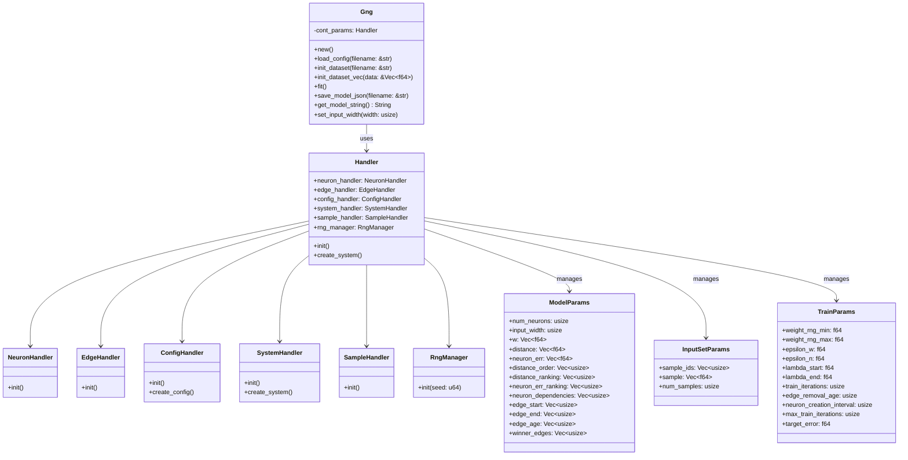
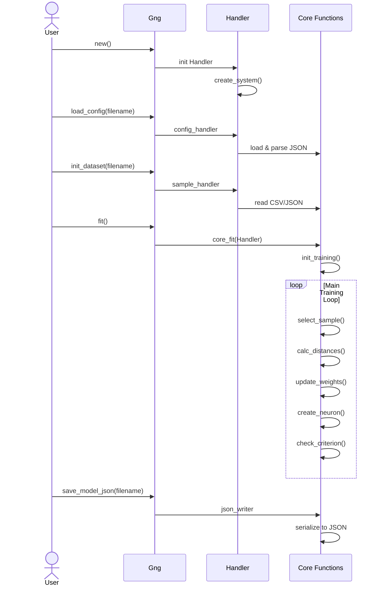

# GNG (Growing Neural Gas) - Code Structure

This document describes the architecture and structure of the GNG (Growing Neural Gas) neural network implementation in Rust.

## Overview

The GNG codebase implements a self-organizing neural network algorithm with the following core components:

- **Data Structures**: Core parameter types for model, training, and input data
- **Handlers**: Specialized modules for managing neurons, edges, configuration, and system state
- **GAS (Gas Algorithm)**: Core algorithm implementation with I/O utilities
- **ECS**: Entity-Component-System pattern for system management

---

## Directory Structure

```
src/
├── lib.rs                 # Library entry point (exports Gng public API)
├── data_structures/       # Data structure definitions
│   ├── mod.rs
│   ├── model_params.rs    # Model parameters (neurons, edges, weights)
│   ├── input_set_params.rs # Input sample data parameters
│   └── train_params.rs    # Training configuration parameters
├── handlers/              # Handler modules for system management
│   ├── mod.rs
│   ├── config_handler.rs  # Configuration management
│   ├── neuron_handler.rs  # Neuron operations
│   ├── edge_handler.rs    # Edge/connection operations
│   ├── sample_handler.rs  # Training sample management
│   └── system_handler.rs  # Overall system state
├── gas/                   # Gas algorithm implementation
│   ├── mod.rs
│   ├── core.rs           # Main algorithm logic
│   ├── csv_reader.rs     # CSV input reading
│   ├── json_reader.rs    # JSON input reading
│   ├── json_writer.rs    # JSON output writing
│   └── rng_manager.rs    # Random number generation
├── ecs/                   # Entity-Component-System
│   ├── mod.rs
│   └── manager.rs        # ECS manager
└── tests/                 # Test modules
    ├── mod.rs
    ├── integration_tests.rs
    └── sample_handler_tests.rs
```

---

## Component Architecture

### 1. Public API - `Gng` Struct

```rust
pub struct Gng {
    cont_params: internal::Handler,
}
```

**Key Methods:**
- `new()` - Initialize a new GNG instance
- `load_config(filename)` - Load configuration from file
- `init_dataset(filename)` - Initialize from dataset file
- `init_dataset_vec(data)` - Initialize from vector of f64 values
- `fit()` - Run the training algorithm
- `save_model_json(filename)` - Export model to JSON
- `get_model_string()` - Get model as string
- `set_input_width(width)` - Set input dimension

---

## Data Structures

### ModelParams

```rust
pub struct Params {
    // Dimensions
    pub num_neurons: usize,
    pub input_width: usize,
    
    // Neuron data (length = num_neurons * input_width)
    pub w: Vec<f64>,                    // Weights
    pub distance: Vec<f64>,             // Distance to current input
    pub neuron_err: Vec<f64>,           // Error values
    
    // Rankings and dependencies
    pub distance_order: Vec<usize>,
    pub distance_ranking: Vec<usize>,   // Ordered by distance (0 = winner)
    pub neuron_err_ranking: Vec<usize>, // Ordered by error
    pub neuron_dependencies: Vec<usize>,// 1=winner, 2=neighbor, 0=other
    
    // Edge data (parallel arrays)
    pub edge_start: Vec<usize>,
    pub edge_end: Vec<usize>,
    pub edge_age: Vec<usize>,
    pub winner_edges: Vec<usize>,
}
```

### InputSetParams

```rust
pub struct Params {
    pub sample_ids: Vec<usize>,
    pub sample: Vec<f64>,
    pub num_samples: usize,
}
```

### TrainParams

```rust
pub struct TrainParams {
    pub weight_rng_min: f64,
    pub weight_rng_max: f64,
    pub epsilon_w: f64,          // Winner learning rate
    pub epsilon_n: f64,          // Neighbor learning rate
    pub lambda_start: f64,       // Initial neighborhood
    pub lambda_end: f64,         // Final neighborhood
    pub train_iterations: usize,
    pub d: f64,
    pub alpha: f64,
    pub edge_removal_age: usize,
    pub neuron_creation_interval: usize,
    pub max_train_iterations: usize,
    pub target_error: f64,
}

pub struct AlgorithmState {
    pub train_initiated: bool,
    pub dataset_initiated: bool,
    pub train_completed: bool,
    pub create_neuron_scheduled: bool,
    pub curr_iteration: usize,
    pub curr_epoch: usize,
    // ... other state flags
}
```

---

## Handlers

### System Handler

Manages the overall training state machine and neuron tracking.

```rust
pub enum State {
    Init,
    StartNewIteration,
    TrainingCompleted,
    NormalIteration,
    EpochCompleted,
    IterationCompleted,
}

struct System {
    // State flags
    pub train_initiated: bool,
    pub train_completed: bool,
    pub normal_iteration: bool,
    
    // Iteration tracking
    pub curr_iteration: usize,
    pub curr_epoch: usize,
    pub sample_order: Vec<usize>,
    pub sample_order_position: usize,
    
    // Neuron tracking
    pub winner_neuron: usize,
    pub second_neuron: usize,
    pub neighbor_neurons: Vec<usize>,
    pub neighbor_neuron_winner: usize,
    pub neuron_max_err: usize,
    pub newest_neuron_id: usize,
}
```

### Neuron Handler

```rust
pub struct NeuronHandler {
    // Manages neuron-related operations
    // Coordinates with model_params for neuron data
}
```

### Edge Handler

```rust
pub struct EdgeHandler {
    // Manages edge creation, deletion, and aging
    // Coordinates with model_params for edge data
}
```

### Config Handler

```rust
pub struct ConfigHandler {
    // Manages configuration loading and creation
}
```

### Sample Handler

```rust
pub struct SampleHandler {
    // Manages input sample selection and access
    // Coordinates with input_set_params
}
```

---

## Gas Algorithm (core.rs)

### Central Handler Structure

```rust
pub struct Handler {
    pub neuron_handler: NeuronHandler,
    pub edge_handler: EdgeHandler,
    pub config_handler: ConfigHandler,
    pub system_handler: SystemHandler,
    pub sample_handler: SampleHandler,
    pub rng_manager: RngManager,
}
```

### Main Training Loop (fit function)

The algorithm cycles through states:

```
Init
  ↓
Initialize Training
  ↓
StartNewIteration → Shuffle Dataset
  ↓
NormalIteration → Select Sample → Calculate Distances
           ↓
        Update Weights
           ↓
        Create/Remove Edges and Neurons
           ↓
        Decrease Global Error
  ↓
EpochCompleted → Check Stopping Criterion
  ↓
TrainingCompleted
```

---

## UML Class Diagram



---

## Sequence Diagram: Training Flow



---
mermaid
flowchart TD
    A[Input Sample] --> B[Calculate Distances]
    B[Calculate Distances<br/>sample vs all neurons] --> C[Find Winner & Runner-up]
    C[Find Winner & Runner-up<br/>2 nearest neurons] --> D[Find Neighbor Neurons]
    D[Find Neighbor Neurons<br/>connected to winner] --> E{Processing}
    
    E --> F[Update Weights]
    F[Update Weights<br/>- Winner<br/>- Neighbors] --> G[Complete]
    
    E --> H[Update Edges]
    H[Update Edges<br/>- Increase ages<br/>- Remove old<br/>- Create new] --> G
    
    E --> I[Neuron Creation]
    I[Neuron Creation<br/>- If scheduled<br/>- Insert new<br/>- Update indices] --> G[Complete]
                 │ - Insert new     │
                 │ - Update indices │
                 └──────────────────┘
```

---

## Algorithm State Machine

```
                    ┌────────────┐
                    │    Init    │
                    └─────┬──────┘
                          │
                          ↓
            ┌─────────────────────────────┐
            │ Initialize Training         │
            │ Shuffle Dataset             │
            │ Set train_initiated = true  │
            └─────────────────┬───────────┘
                              │
                              ↓
                  ┌─────────────────────┐
                  │ StartNewIteration   │
                  └─────────┬───────────┘
                            │
                ┌───────────┴───────────┐
                ↓                       ↑
      ┌──────────────────┐    Epoch not complete
      │ NormalIteration  │    └─────────────┐
      │ (loop samples)   │                  │
      └─────────┬────────┘                  │
                │                          │
   mermaid
stateDiagram-v2
    [*] --> Init
    Init --> InitTraining: initialize
    InitTraining --> StartNewIteration: shuffle dataset
    
    StartNewIteration --> NormalIteration
    
    NormalIteration --> EpochCompleted: samples complete
    
    EpochCompleted --> CheckCriterion{Stopping<br/>criterion met?}
    CheckCriterion -->|No| StartNewIteration: increment epoch
    CheckCriterion -->|No| Reshuffle: shuffle dataset
    Reshuffle --> NormalIteration
    
    CheckCriterion -->|Yes| TrainingCompleted
    TrainingCompleted --> [*]
  ├─→ data_structures/train_params.rs
  │
  ├─→ ecs/manager.rs
  │
  └─→ handlers/mod.rs
        ├─→ config_handler.rs
        ├─→ neuron_handler.rs
        ├─→ edge_handler.rs
        ├─→ sample_handler.rs
        └─→ system_handler.rs
```

---

## Key Operations Flow

### 1. Initialization

```
Gng::new()
  → Handler::init()
    → NeuronHandler::init()
    → EdgeHandler::init()
    → ConfigHandler::init()
    → SystemHandler::init()
    → SampleHandler::init()
    → RngManager::init(seed)
  → create_system()
    → ConfigHandler::create_config()
    → SystemHandler::create_system()
```

### 2. Dataset Loading
mermaid
graph TD
    A[lib.rs<br/>Public API - Gng]
    B[gas/core.rs<br/>fit function, main logic]
    
    A --> B
    
    B --> C[handlers/neuron_handler.rs]
    B --> D[handlers/edge_handler.rs]
    B --> E[handlers/config_handler.rs]
    B --> F[handlers/system_handler.rs]
    B --> G[handlers/sample_handler.rs]
    
    B --> H[gas/json_reader.rs]
    B --> I[gas/json_writer.rs]
    B --> J[gas/csv_reader.rs]
    B --> K[gas/rng_manager.rs]
    
    A --> L[data_structures/model_params.rs]
    A --> M[data_structures/input_set_params.rs]
    A --> N[data_structures/train_params.rs]
    
    A --> O[ecs/manager.rs]
    
    A --> P[handlers/mod.rs]
    P --> C
    P --> D
    P --> E
    P --> F
    P --> Gurons
      - Create new neurons (if scheduled)
      - Decrease global error
      - Check stopping criterion
```

### 4. Model Export

```
save_model_json(filename)
  → core_save_model_json()
    → JSONWriter serializes:
      - All neuron weights (w)
      - All edges (start, end, age)
      - Configuration parameters
      - Training statistics
```

---

## Type System Overview

| Component | Type | Purpose |
|-----------|------|---------|
| `Gng` | Public Struct | Main API entry point |
| `Handler` | Struct | Container for all handlers |
| `NeuronHandler` | Struct | Manages neuron operations |
| `EdgeHandler` | Struct | Manages edge operations |
| `SystemHandler` | Struct | Manages training state |
| `ConfigHandler` | Struct | Manages configuration |
| `SampleHandler` | Struct | Manages input samples |
| `RngManager` | Struct | Random number generation |
| `State` | Enum | Training state transitions |
| `Params` (model) | Struct | Model parameters |
| `Params` (input) | Struct | Input sample parameters |
| `TrainParams` | Struct | Training configuration |

---

## Summary

The GNG implementation follows a modular architecture with clear separation of concerns:

1. **Public API Layer** (`Gng`): Simple interface for users
2. **Core Algorithm** (`gas/core.rs`): Main GNG algorithm with state machine
3. **Handler Layer**: Specialized modules for different aspects (neurons, edges, config, system state, samples)
4. **Data Structures**: Type-safe parameter containers
5. **I/O Layer**: CSV/JSON reading and writing
6. **Utility Layer**: Random number generation and ECS management

This architecture enables:
- Easy testing of individual components
- Clean separation between algorithm logic and state management
- Flexible configuration and I/O
- Extensibility for new features
